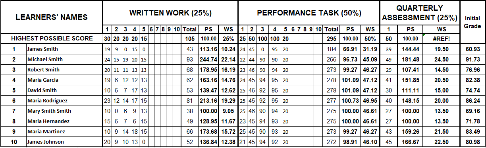
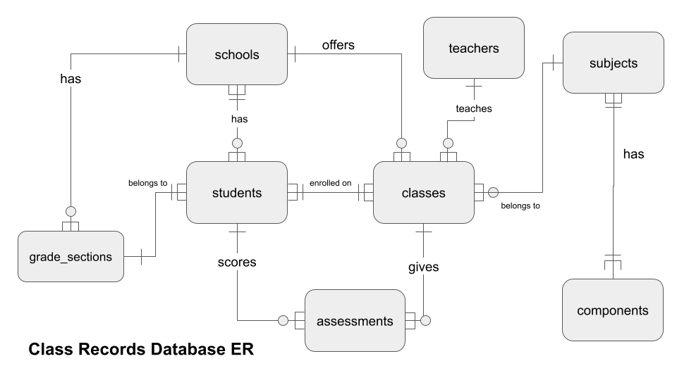

# Design Document (Class Records Database)

By _Cyrille C. Cervantes_

Video overview: [Student Records Database - CS50 SQL Project](https://www.youtube.com/watch?v=AXD-8H0x8uE)

## Scope

### Purpose
The purpose of the database is to efficiently manage and store students records handled by teachers. This involves creating a robust SQL database capable of housing information such as student scores, grades and relevant data.

Essentially, the main goal of the project is to be able to replicate this sample table below where scores and grades of each student are properly managed by the sql database.

### Inclusions

The database encompasses the following entities:
* `schools` which includes some basic information about the school;
*  `teachers` who handles the classes;
* `students` attending a certain school and some of their basic information;
* `sections` of each grade level in the school where students belong to;
* `subjects` offered in the K-12 program and their components needed for computing student's grade;
* `classes` offered in the school;
* `assessments` given to each class; and
* the individual `scores` of students on each respective assessments.

On the other hand, the database excludes:
- the `demographic` information of the students as only the necessary basic information are included.

This design streamlines the database, focusing specifically on the elements directly tied to class records and student performance, while having on mind the end-goal of providing a user-friendly interface for teachers.

## Functional Requirements

This database will support
* CRUD operations for `schools`, `teachers`, `subjects` and its `components`, `classes`, `grade_sections`, `students`, the schools they have attended, the classes they are enrolled in, the `assessments` given to each classes, and the `scores` of each student on each assessment.

The design of the database enable us to do the following:
- List all the students enrolled in a certain class;
- List all the classes taken by each student;
- List all the scores of the students; and lastly
- Compute for the grades of each student for each classes they are enrolled in.

## Representation

### Entities

Entities are captured in SQLite tables with the following schema.

_**Disclaimer**: Most parts of this section were created by ChatGPT since this is a boring and tedious work. So, many thanks to ChatGPT! 😊._

  
schools

The `schools` table includes:
- `id`, which specifies the unique ID for the school as an `INTEGER`. This identifies the school hence `PRIMARY KEY` constraint is applied.
- `name`, which is the official name of the school in `TEXT` form. Appropriate for name fields, `TEXT` is used.
- `region`, which specifies which region in the Philippines the school belongs to. The type is specified as `TEXT` since there are regions that contain letters in it.
- `division`, which states the division belongs to in `TEXT` type.

  
teachers

The `teachers` table includes the following.
- `id`, which specifies the unique ID for the teacher as an `INTEGER`. This column thus has the `PRIMARY KEY` constraint applied.
- `first_name`, which specifies the first name of the teacher as `TEXT`. Appropriate for name fields, `TEXT` is used.
- `middle_initial`, which specifies the middle initial of the teacher as `TEXT`. This field is `NULLABLE` since not all people have middle initial.
- `last_name`, which specifies the teachers's last name. `TEXT` is used for the same reason as `first_name`.'s last name. `TEXT` is used for the same reason as `first_name`.

Normally, this table could only contain one data assuming there is only one teacher who handles a certain class.

  
subjects

The `subjects` table includes the following.
- `id`, which specifies the unique ID for the subject as an `INTEGER`. This column thus has the `PRIMARY KEY` constraint applied.
- `name`, which is the official name of the subject in `TEXT` form. Appropriate for name fields, `TEXT` is used.
- `level` which specifies the grade level of the subject in `INTEGER`. For non grade school subject, this might correspond to the number in the course name.
- `track` which distinguishes the track of the subject, be it belongs to one of the following: _Academic_; _Technical-Vocational-Livelihood_; or _Sports and Arts_. For grade school subjects this is `NULLABLE`.

  
components

The table `components` are where we store the components of a subject needed for grade computation. The table includes the following:
- `id`, which specifies the unique ID for the component as an `INTEGER`. This column thus has the `PRIMARY KEY` constraint applied.
- `name`, which is the name of the component in `TEXT` form. Appropriate for name fields, `TEXT` is used.
- `percentage`, which specifies the weight of the component in relation to the computation of grades. The data should be in `REAL` type and should be less than or equal to 1.0.

  
subject_components

This table, `subject_components` is where we store the relationship between the subject and its components.
- `subject_id`, which specifies the unique ID for the subject from the `subjects` table.
- `component_id`, which specifies the unique ID for the subject from the `components` table.
- The pair (`subject_id`, `component_id`) is subjected to `UNIQUE` constraint to avoid repeition of data.

  
classes

The `classes` table includes the following.
- `id`, which specifies the unique ID for the class as an `INTEGER`. This column thus has the `PRIMARY KEY` constraint applied.
- `name`, which stores the formatted name of the class in `TEXT` form. Appropriate for name fields, `TEXT` is used. The name should obey the following format: `{subject} {grad_level} {section_name} A.Y. {year} {sem} Sem`
- `subject_id`, which specifies the ID from the `subjects` table corresponding to the subject taught in the class.
- `teacher_id`, which specifies the ID from the `subjects` table corresponding to the teacher that manages the class.
- `school_id`, which specifies the ID from the `schools` table corresponding to the school where the class is taught.
- `year`, which is the academic year (the first number in `INTEGER`) the class is taught.
- `year`, which is the semester (in `INTEGER`) the class is taught.

  
grade_sections

The `grade_sections` table comprises the following fields:
- `id`: An `INTEGER` representing the unique identifier for each grade section. This field is marked as `NOT NULL` and serves as the `PRIMARY KEY`.
- `grade`: An `INTEGER` indicating the academic grade associated with the section. This field is marked as `NOT NULL`.
- `name`: A `TEXT` field holding the name of the grade section. This field is marked as `NOT NULL`.
- `school_id`: An `INTEGER` specifying the ID from the schools table corresponding to the school where the grade section is located. This field is optional.
- `adviser`: A `TEXT` field storing the name or identifier of the adviser for the grade section. This field is optional.
- `year`: An `INTEGER` denoting the academic year associated with the grade section. Only the first year is stored.

  
students

The `students` table is defined by the following fields:
- `id`: An `INTEGER` serving as the unique identifier for each student. This field is marked as the `PRIMARY KEY`.
- `first_name`: A `TEXT` field representing the first name of the student. This field is marked as `NOT NULL`.
- `middle_name`: A `TEXT` field for capturing the middle name of the student. This field is optional since not all students have middle name.
- `last_name`: A `TEXT` field holding the last name of the student. This field is marked as NOT NULL.
- `birth_date`: A `DATE` field indicating the birth date of the student. This field is optional.
- `gender`: An `INTEGER` field representing the gender of the student.

  
students_schools

The `students_schools` table records the schools that students have attended with the following fields. This table provides information about the schools each student has attended, including start and, if applicable, end dates of attendance.
* `id`: An `INTEGER` serving as the unique identifier for each record in the table. This field is marked as the `PRIMARY KEY`.
* `student_id`: An `INTEGER` indicating the unique ID of the student associated with the school attendance. This field is marked as `NOT NULL` and is linked to the id field in the `students` table through a foreign key constraint.
* `school_id`: An `INTEGER` specifying the unique ID of the school attended by the student. This field is marked as `NOT NULL` and is linked to the id field in the `schools` table through a foreign key constraint.
* `start_date`: A `DATE` field indicating the start date when the student began attending the specified school. This field is marked as NOT NULL.
* `end_date`: A `DATE` field representing the optional end date when the student concluded attendance at the specified school.

  
students_sections

The `students_sections` table documents the sections to which students are assigned, featuring the following fields:
* `id`: An `INTEGER` acting as the unique identifier for each record in the table. This field is marked as the `PRIMARY KEY`.
* `student_id`: An `INTEGER` indicating the unique ID of the student. This field is marked as `NOT NULL` and is linked to the id field in the `students` table through a foreign key constraint.
* `section_id`: An `INTEGER` specifying the unique ID of the grade section to which the student is assigned. This field is marked as `NOT NULL` and is linked to the id field in the `grade_sections` table through a foreign key constraint.

Unique Constraint:
* A `UNIQUE` constraint is applied to the combination of `student_id` and `section_id` fields, ensuring that each student is uniquely associated with a grade section.

This table captures the assignments of students to specific grade sections, preventing duplicate entries for the same student and section pair.

  
students_classes

The `students_classes` table records the classes in which students are enrolled, featuring the following fields:
- `student_id`: An `INTEGER` indicating the unique ID of the student. This field is marked as `NOT NULL` and is linked to the id field in the `students` table through a foreign key constraint.
- `class_id`: An `INTEGER` specifying the unique ID of the class in which the student is enrolled. This field is marked as `NOT NULL` and is linked to the id field in the `classes` table through a foreign key constraint.

Unique Constraint:
- A `UNIQUE` constraint is applied to the combination of `student_id` and `class_id` fields, ensuring that each student is uniquely associated with a class.

  
assessments

The `assessments` table documents assessments under certain `components` with the following fields:
* `id`: An `INTEGER` serving as the unique identifier for each assessment. This field is marked as the `PRIMARY KEY`.
* `name`: A `TEXT` field representing the name of the assessment.
* `max_score`: An `INTEGER` field specifying the maximum achievable score for the assessment. This field is marked as `NOT NULL`.
* `subject_id`: An `INTEGER` indicating the ID from the subjects table corresponding to the subject under which the assessment falls. This field is optional.
* `component_id`: An `INTEGER` specifying the ID from the components table corresponding to the component under which the assessment is categorized. This field is marked as `NOT NULL` and is very much needed for the grade computaiton. It is linked to the id field in the `components` table through a foreign key constraint.
* `quarter`: An `INTEGER` field denoting the quarter during which the assessment is conducted.

  
class_assessments

The `class_assessments` table captures assessments that are given to a certain class:
* `id`: An `INTEGER` serving as the unique identifier for each record in the table. This field is marked as the `PRIMARY KEY`.
* `class_id`: An `INTEGER` specifying the unique ID of the class associated with the assessment. This field is marked as `NOT NULL` and is linked to the id field in the `classes` table through a foreign key constraint.
* `assessment_id`: An `INTEGER` indicating the unique ID of the assessment conducted within the class. This field is marked as `NOT NULL` and is linked to the id field in the `assessments` table through a foreign key constraint.
* `date_given`: A DATE field representing the date on which the assessment was conducted.

Unique Constraint:
- A `UNIQUE` constraint is applied to the combination of `class_id` and `assessment_id` fields, ensuring that each class is uniquely associated with an assessment.

  
scores

The `scores` table stores scores of each student on a certain assessment with the following fields:
* `id`: An `INTEGER` serving as the unique identifier for each score. This field is marked as the `PRIMARY KEY`.
* `student_id`: An `INTEGER` indicating the unique ID of the student for whom the score is recorded. This field is marked as `NOT NUL`L and is linked to the id field in the `students` table through a foreign key constraint.
* `assessment_id`: An INTEGER indicating the unique ID of the assessment for which the score is recorded. This field is marked as `NOT NULL` and is linked to the id field in the `assessments` table through a foreign key constraint.
* `value`: A `REAL` field representing the score achieved by the student. This field has a default value of 0.0 in case the student fails to take the exam.

These tables collectively provide a comprehensive structure for managing information related to student enrollment in classes, assessments, and their respective scores.

### Relationships

The entity relationship diagram below illustrates the connections between the entities within the database.

As outlined by the diagram:
* A `school` manages no or multiple `grade_sections`, has no or many `students` and offers no or many `classes`.
* A `teacher` can teach many `classes` but a `class` should only have one `teacher`.
* `students` could be admitted to many schools as long as there is time conflict. He/she belongs to a certain `grade_section` managed by its current school, is enrolled to one or many `classes` (needs to be enrolled to at least one class to be called a student).
* A `class` is taught by a `teacher` in a `school` with a `subject` and should have at least one `student`. A class could give 0 to many `assessments` (zero assessments may mean the class has yet to give an assessment).
* A `subject` should at least have one `component` that is need for the grade computation. All the weights of the components should add up to 1.0.
* To record the `scores` of the students, a `student` could take many `assessments` of different kind however, one `score` of that assessment is only given to the student.

## Optimizations

The use-case of the database is assumed to use "id" as way to search for entities. Hence, there is no need to create indices for other columns. Since, ids as primary keys are automatically created for us by sqlite, I opted to not create indices anymore.

In addition, the database is assumed to be small, basing on the generalization that teachers usually handle 4-6 classes, hence, any optimizations could be insignificant.

## Limitations

With the current schema, sqlite alone cannot produce in one table the more detailed computation of the grades as there are dynamic numbers of quizzes as well as number of subject components. One work-around could be to use scripting program to overcome this problem.
